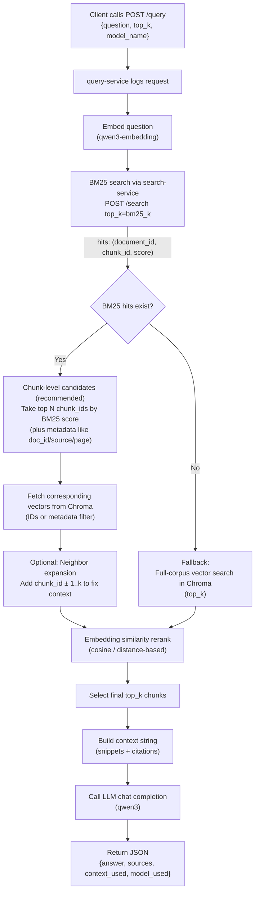

```mermaid
flowchart TD
  A["Client calls POST /query<br/>{question, top_k, model_name}"] --> B["query-service logs request"]

  B --> C["Embed question<br/>(qwen3-embedding)"]
  C --> D["BM25 search via search-service<br/>POST /search top_k=bm25_k"]
  D -->|"hits: (document_id, chunk_id, score)"| E{"BM25 hits exist?"}

  E -- No --> F["Fallback:<br/>Full-corpus vector search in Chroma<br/>(top_k)"]
  E -- Yes --> G["Chunk-level candidates (recommended)<br/>Take top N chunk_ids by BM25 score<br/>(plus metadata like doc_id/source/page)"]

  G --> H["Fetch corresponding vectors from Chroma<br/>(IDs or metadata filter)"]
  H --> I["Optional: Neighbor expansion<br/>Add chunk_id ± 1..k to fix context"]
  I --> J["Embedding similarity rerank<br/>(cosine / distance-based)"]

  F --> J

  J --> K["Select final top_k chunks"]
  K --> L["Build context string<br/>(snippets + citations)"]
  L --> M["Call LLM chat completion<br/>(qwen3)"]
  M --> N["Return JSON<br/>{answer, sources, context_used, model_used}"]
```
