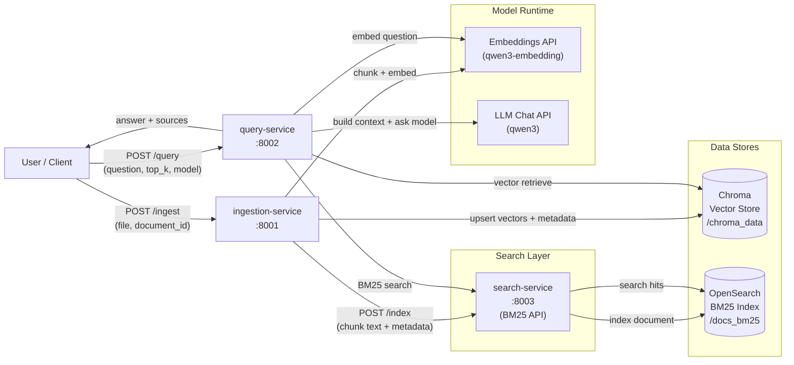

```mermaid
flowchart LR
  U["User / Client"] -->|"POST /ingest<br/>(file, document_id)"| I["ingestion-service<br/>:8001"]
  U -->|"POST /query<br/>(question, top_k, model)"| Q["query-service<br/>:8002"]

  subgraph Data_Stores["Data Stores"]
    C[("Chroma<br/>Vector Store<br/>/chroma_data")]
    OS[("OpenSearch<br/>BM25 Index<br/>/docs_bm25")]
  end

  subgraph Search_Layer["Search Layer"]
    S["search-service<br/>:8003<br/>(BM25 API)"]
  end

  subgraph Model_Runtime["Model Runtime"]
    E["Embeddings API<br/>(qwen3-embedding)"]
    L["LLM Chat API<br/>(qwen3)"]
  end

  I -->|"chunk + embed"| E
  I -->|"upsert vectors + metadata"| C
  I -->|"POST /index<br/>(chunk text + metadata)"| S
  S -->|"index document"| OS

  Q -->|"embed question"| E
  Q -->|"BM25 search"| S
  S -->|"search hits"| OS
  Q -->|"vector retrieve"| C
  Q -->|"build context + ask model"| L
  Q -->|"answer + sources"| U
```
