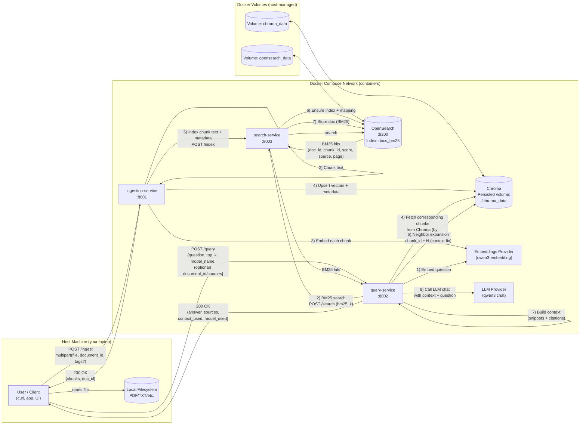

```mermaid
flowchart LR
  %% =========================
  %% Host / Client side
  %% =========================
  subgraph HOST["Host Machine (your laptop)"]
    U["User / Client<br/>(curl, app, UI)"]
    FS[("Local Filesystem<br/>PDF/TXT/etc.")]
    U -->|reads file| FS
  end

  %% =========================
  %% Docker network / containers
  %% =========================
  subgraph DOCKER["Docker Compose Network (containers)"]
    I["ingestion-service<br/>:8001"]
    Q["query-service<br/>:8002"]
    S["search-service<br/>:8003"]
    OS[("OpenSearch<br/>:9200<br/>Index: docs_bm25")]
    C[("Chroma<br/>Persisted volume:<br/>/chroma_data")]
    E["Embeddings Provider<br/>(qwen3-embedding)"]
    L["LLM Provider<br/>(qwen3 chat)"]
  end

  %% =========================
  %% Shared volumes (mounted into containers)
  %% =========================
  subgraph VOLS["Docker Volumes (host-managed)"]
    VCH[("Volume: chroma_data")]
    VOS[("Volume: opensearch_data")]
  end

  %% Volumes wiring
  VCH <--> C
  VOS <--> OS

  %% =========================
  %% /ingest flow
  %% =========================
  U -->|"POST /ingest<br/>multipart(file, document_id, tags?)"| I
  I -->|"1) Parse file -> text"| I
  I -->|"2) Chunk text"| I
  I -->|"3) Embed each chunk"| E
  I -->|"4) Upsert vectors + metadata"| C
  I -->|"5) Index chunk text + metadata<br/>POST /index"| S
  S -->|"6) Ensure index + mapping"| OS
  S -->|"7) Store doc (BM25)"| OS
  I -->|"200 OK<br/>{chunks, doc_id}"| U

  %% =========================
  %% /query flow (Hybrid RAG Pattern A)
  %% =========================
  U -->|"POST /query<br/>{question, top_k, model_name,<br/>(optional) document_id/sources}"| Q
  Q -->|"1) Embed question"| E

  Q -->|"2) BM25 search<br/>POST /search (bm25_k)"| S
  S -->|search| OS
  OS -->|"BM25 hits<br/>(doc_id, chunk_id, score, source, page)"| S
  S -->|"BM25 hits"| Q

  Q -->|"3) Candidate selection<br/>(chunk-level top N)"| Q
  Q -->|"4) Fetch corresponding chunks<br/>from Chroma (by ids/metadata)"| C

  Q -->|"5) Neighbor expansion<br/>chunk_id ± N (context fix)"| C
  Q -->|"6) Embedding similarity rerank<br/>(cosine/distance)"| Q

  Q -->|"7) Build context<br/>(snippets + citations)"| Q
  Q -->|"8) Call LLM chat<br/>with context + question"| L
  Q -->|"200 OK<br/>{answer, sources,<br/>context_used, model_used}"| U
```
